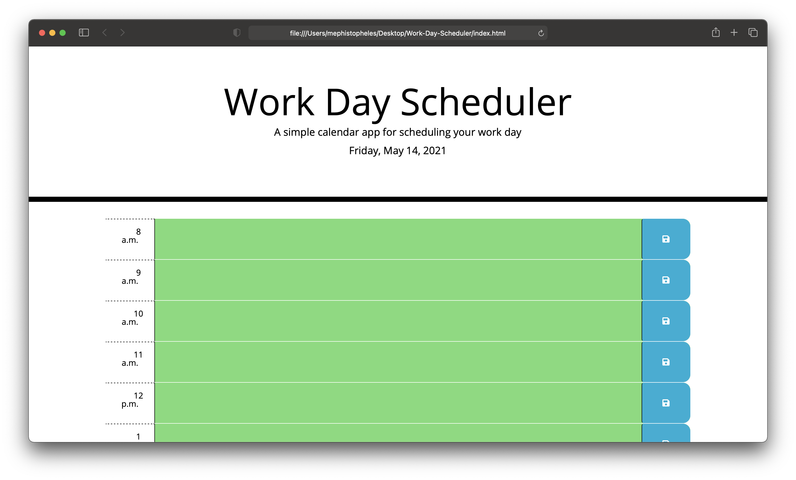

# Work-Day-Scheduler

Description
    This application is a simple calendar application that allows a user to save events for each hour of the day by modifying starter code. The app runs in the browser and feature dynamically updated HTML and CSS powered by jQuery. The app also uses the luxon.js library to work with date and time.

    The appliaction was modified with html to make the app have work day hour scheduling. After the css was modified to contain media queries. Finally the javascript was added in order to bring functionality to the app. Javascript was used to save the information in the schedule to the local storage, and display the time at the top of the scheduler. 

Image
    

Link
    [Work Day Scheduler]()